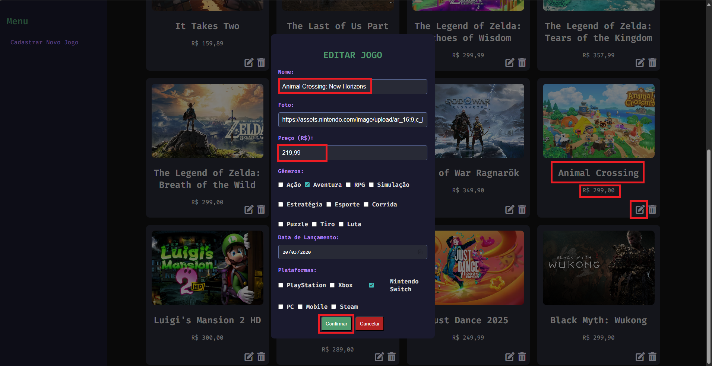
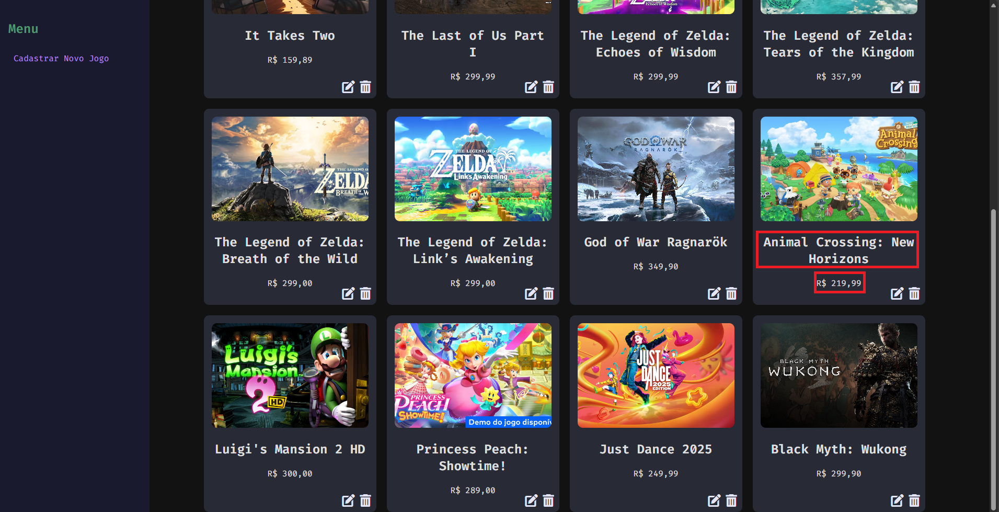
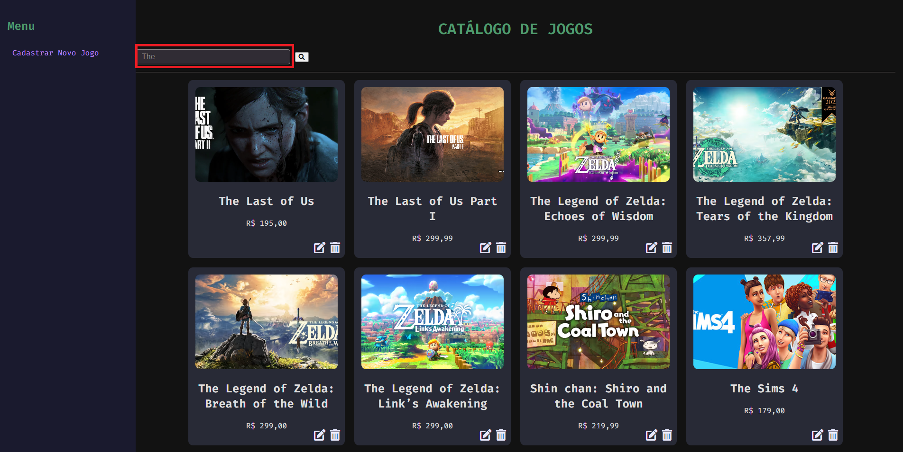
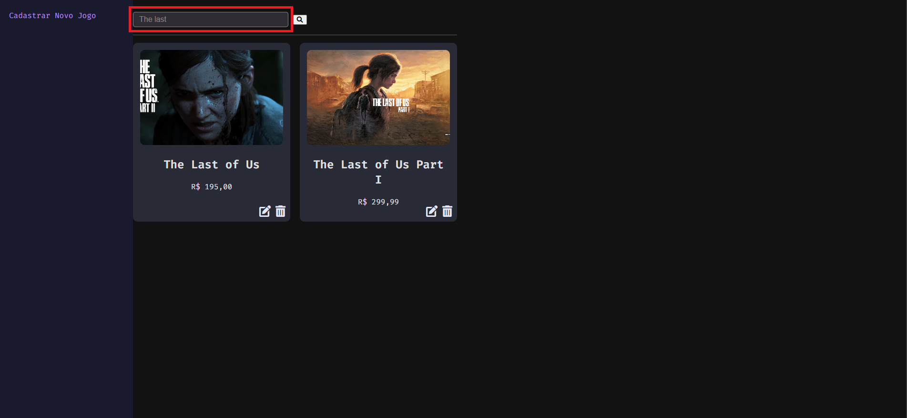

<h1 align="center">👾 Horizons Gamer Shop 👾</h1>

Horizons Gamer Shop é uma plataforma de jogos projetada para oferecer uma experiência diversificada e envolvente. O objetivo é criar um ambiente robusto e escalável onde os gamers possam explorar uma vasta seleção de jogos, desde lançamentos populares até títulos independentes e clássicos.

<h3 align="center">Funcionalidades Desenvolvidas 🕹️</h2>

### Cadastro de Jogos:
- **Descrição:** Permite adicionar novos jogos ao catálogo.
- **Detalhes:** O formulário inclui campos para nome, foto, preço, gêneros, plataformas e data de lançamento. Utiliza checkboxes para selecionar múltiplos gêneros e plataformas.
- **Processo:** Os dados são enviados ao servidor via requisição POST para a rota `/register-game` em formato JSON. Após o envio, uma mensagem de confirmação é exibida e o formulário é resetado para novos cadastros.

### Catálogo de Jogos:
- **Descrição:** Permite visualizar toda a coleção de jogos disponíveis.
- **Interface:** Inclui uma barra lateral fixa com um menu de navegação.
- **Processo:** Ao carregar a página, uma requisição é feita para a rota `/games` para listar os jogos. Em caso de erro na obtenção dos dados, uma mensagem de alerta é exibida.

### Deletar Jogo:

- **Descrição:** Permite remover um jogo específico da coleção de jogos disponíveis no catálogo..
- **Interface:** Inclui um botão de exclusão ao lado de cada jogo listado na página do catálogo.
- **Processo:** Quando o usuário clica no botão de exclusão ao lado do jogo que deseja remover, uma requisição `DELETE` é enviada para a rota `/delete-game/<int:game_id>`. O sistema, então, exibe uma mensagem de confirmação para garantir que a ação de exclusão seja intencional. Caso o usuário confirme, o jogo é removido do banco de dados, e a lista de jogos é atualizada automaticamente. Se houver algum erro durante o processo de exclusão, uma mensagem de alerta é exibida para informar o usuário.

### Deletar Jogo:

- **Descrição:** Permite remover um jogo específico da coleção de jogos disponíveis no catálogo..
- **Interface:** Inclui um botão de exclusão ao lado de cada jogo listado na página do catálogo.
- **Processo:** Quando o usuário clica no botão de exclusão ao lado do jogo que deseja remover, uma requisição `DELETE` é enviada para a rota `/delete-game/<int:game_id>`. O sistema, então, exibe uma mensagem de confirmação para garantir que a ação de exclusão seja intencional. Caso o usuário confirme, o jogo é removido do banco de dados, e a lista de jogos é atualizada automaticamente. Se houver algum erro durante o processo de exclusão, uma mensagem de alerta é exibida para informar o usuário.

### Atualizar Dados Cadastrais:

- **Descrição:** Permite atualizar as informações de um jogo específico no catálogo de jogos.
- **Interface:** A página de atualização inclui um formulário que exibe os dados atuais do jogo a ser editado. O formulário permite a edição de campos como nome, foto, preço, gênero, data de lançamento e plataforma.
- **Processo:** Quando o usuário deseja editar um jogo, ele clica no botão de "editar" ao lado do jogo listado no catálogo, o que o redireciona para a página de atualização. Nessa página, o usuário pode modificar as informações do jogo. Após preencher os campos, o formulário é submetido e uma requisição `PUT` é enviada para a rota `/update-game/<int:game_id>`, com os dados atualizados. O sistema então processa a atualização no banco de dados e exibe uma mensagem de sucesso caso a operação seja bem-sucedida. Se houver algum erro durante o processo, uma mensagem de erro será exibida para o usuário.

### Exemplo Prático: Atualização de Jogo

1. **Tela Inicial (Exibição dos Dados Atuais):**  
   Na tela do catálogo, o jogo "Animal Crossing" está listado com o preço atual de R$ 299,99. Ao lado do jogo, há um botão "Editar" que, ao ser clicado, abre um pop-up com os dados atuais do jogo.

2. **Pop-up de Edição (Edição dos Dados):**  
   Ao clicar no botão "Editar", um pop-up é exibido com um formulário preenchido automaticamente com os dados atuais. Para esse caso foram feitas alterações no nome e preço do jogo. 
   
         - **Nome:** Animal Crossing: New Horizons
         - **Preço:** R$ 219,90 
   

Obs: O usuário pode então alterar o nome e preço ou qualquer outro campo, caso necessário.

3. **Processo de Atualização:**  
   Após editar os dados no pop-up, o usuário confirma a alteração. Uma requisição `PUT` é enviada para a rota `/update-game/<game_id>`, atualizando o preço do jogo no banco de dados.

4. **Tela Final (Dados Atualizados):**  
   Após a atualização bem-sucedida, o pop-up é fechado automaticamente, e a página do catálogo é atualizada para refletir o novo preço do jogo "Animal Crossing: New Horizons", agora exibido como R$ 219,99. 

### Pesquisa de Jogos:

- **Descrição:** Permite buscar jogos no catálogo com base no nome fornecido pelo usuário.
- **Interface:** A pesquisa é realizada através de uma requisição GET para o endpoint `/search-games`, com o parâmetro `name` especificando o nome do jogo.
- **Processo:** O usuário envia uma requisição GET para `/search-games`, passando o parâmetro `name` com o nome do jogo desejado. Se o parâmetro `name` estiver vazio, a resposta será uma lista vazia. A resposta retorna uma lista de jogos encontrados, com informações como nome, preço, plataforma e data de lançamento. Se ocorrer algum erro, será retornada uma mensagem de erro.

 O microserviço utiliza o método fuzzy para filtrar os jogos que contêm o termo no nome. Esse método permite que a busca encontre uma correspondência aproximada ao invés de exata. 

