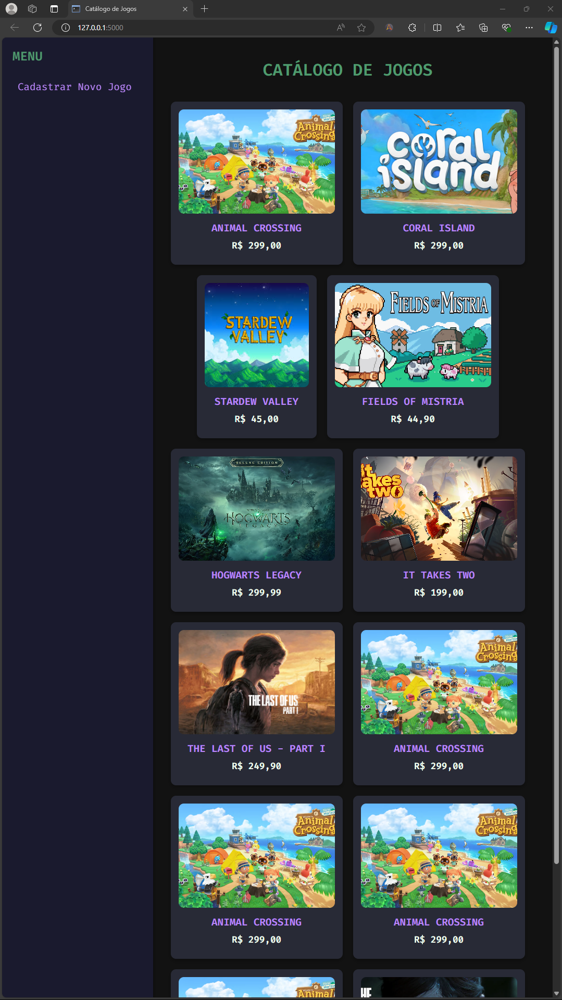

# Horizons Gamer Shop

Horizons Gamer Shop é uma plataforma de jogos projetada para oferecer uma experiência diversificada e envolvente. O objetivo é criar um ambiente robusto e escalável onde os gamers possam explorar uma vasta seleção de jogos, desde lançamentos populares até títulos independentes e clássicos.

## Funcionalidades

### Cadastro de Jogos
- **Descrição:** Permite adicionar novos jogos ao catálogo.
- **Detalhes:** O formulário inclui campos para nome, foto, preço, gêneros, plataformas e data de lançamento. Utiliza checkboxes para selecionar múltiplos gêneros e plataformas.
- **Processo:** Os dados são enviados ao servidor via requisição POST para a rota `/register-game` em formato JSON. Após o envio, uma mensagem de confirmação é exibida e o formulário é resetado para novos cadastros.

### Catálogo de Jogos
- **Descrição:** Permite visualizar toda a coleção de jogos disponíveis.
- **Interface:** Inclui uma barra lateral fixa com um menu de navegação.
- **Processo:** Ao carregar a página, uma requisição é feita para a rota `/games` para listar os jogos. Em caso de erro na obtenção dos dados, uma mensagem de alerta é exibida.

